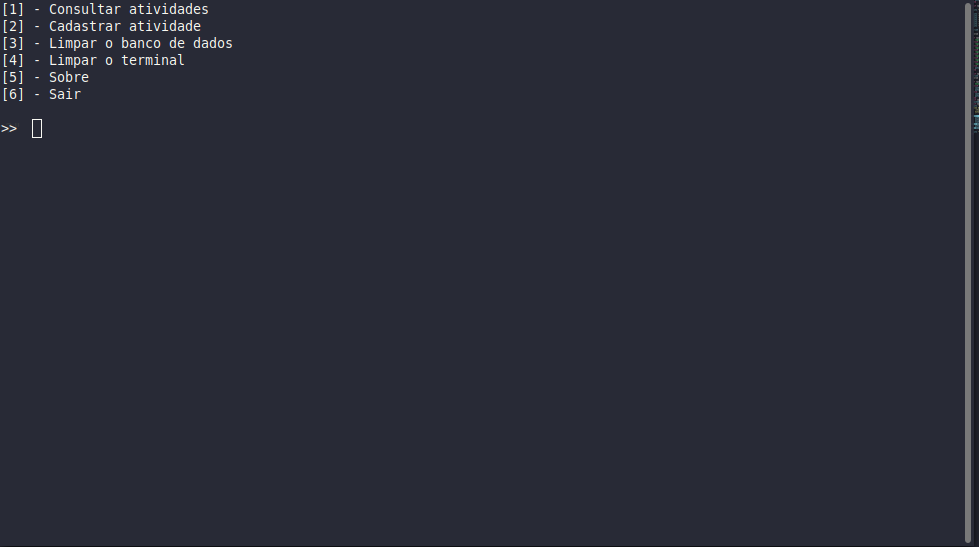

<h1 align="center">📅 agen</h1>

<p align="center">
    
    &nbsp;&nbsp;
    &nbsp;&nbsp;
    
</p>

<p align="center">
    <a href="#">Tecnologias</a>&nbsp;&nbsp;&nbsp;|&nbsp;&nbsp;&nbsp;
    <a href="#">Projeto</a>&nbsp;&nbsp;&nbsp;|&nbsp;&nbsp;&nbsp;
    <a href="#">Instalação</a>&nbsp;&nbsp;&nbsp;|&nbsp;&nbsp;&nbsp;
    <a href="#">Tecnologias</a>&nbsp;&nbsp;&nbsp;|&nbsp;&nbsp;&nbsp;
    <a href="#">Licença</a>
</p>

## 💻 About the Project

`Agen` is a schedule, when a new activity is registered, the information is saved in an external text file, that is, even if you close the terminal or turn off your computer, the information will still be accessible.

## How To Use 🔧
---

if you don't have ruby installed use
```bash
sudo apt-get install ruby-full
```

if you already have ruby installed use
```bash
# Clone this repository
$ git clone https://github.com/username/agen

# Go into the repository
$ cd agen

# give execution permission
chmod +x app.rb

# run
$ ruby app.rb
```

<h2>Project image</h2>



## 🚀 Technology

- Ruby

## License 📄

This project is licensed under the MIT License - see the [LICENSE.md](LICENSE.md) file for details

[](https://twitter.com/https://twitter.com/username) [](mailto:johndoe@gmail.com)
