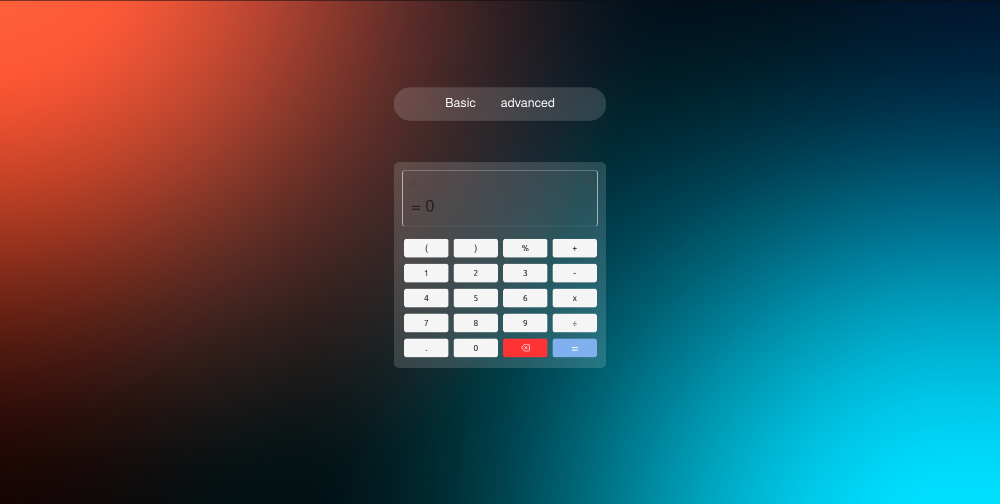

<h1 align="center">Welcome to my super calculator :wave:</h1>

<p align="center">
    
    &nbsp;&nbsp;
    &nbsp;&nbsp;
    
</p>

<p align="center">
    <a href="#about">About</a>&nbsp;&nbsp;&nbsp;|&nbsp;&nbsp;&nbsp;
    <a href="#installation">Installation</a>&nbsp;&nbsp;&nbsp;|&nbsp;&nbsp;&nbsp;
    <a href="#technology">Technology</a>&nbsp;&nbsp;&nbsp;|&nbsp;&nbsp;&nbsp;
    <a href="#license">License</a>
</p>

<br/><br/>

## <span id="about">:speech_balloon: About</span>
This is a simple and ´modern calculator´ capable of solving basic calculations and some advanced calculations like: logarithm, square root, tangent, cosine, sine and percentage. This calculator is divided into two parts that I call basic calculator and advanced calculator, the basic calculator can only be done simple calculations such as: addition, division, subtraction, multiplication and percentage in the advanced calculator in addition to what was mentioned above it is possible to perform more calculations such as: logarithm, square root, tangent, cosine, sine. This calculator stores the calculations performed by the user in localStorage providing a history for the user including a button to delete the history, in case the user forgets the result of an operation done previously he can easily see the result in the history.

The base technology for creating this project was the [React.js](https://reactjs.org/)`18.0.0` to develop this project I took about 1 week after some trial and error, This website is fully responsive and can be accessed from any device.<br/>

<br/>

> This project is already hosted on the vercel website and ready to use, to access the web page click [aqui](https://callculator.vercel.app/).

<br />

## <span id="preview">:sparkles: Preview</span>

Home page <br><br/>

<p align="center">
  
</p>

<br/>

## <span id="installation">:man_technologist: Quick Start</span>

To use the website on your local machine follow the steps below:

Cloning the Repository:

```sh
git clone https://github.com/username/Calculator.git
```

Accessing the project folder:

```sh
cd Calculator
```

Install dependeces:

```sh
yarn
```

Execute:

```sh
yarn dev
```

<br />

## <span id="details">:interrobang: Details</span>

For the construction of this calculator I used a lib created by Facebook called `Jest.js` for the integration of the unit tests to verify if the results of the calculations remained correct, to run the tests just type the command below in your terminal:

```sh
yarn test
```

<br />

## <span id="difficulties">:cursing_face: Difficulties</span>

My biggest difficulty when developing this calculator was when integrating the unit tests, I didn't use the TDD (Test Driven Developen) pattern, that is, I didn't integrate the tests first, then the functionality, so this made it very difficult in the test integration process. <br />

## <span id="technology">:rocket: Technologies</span>

This project was developed with the following technologies:

- [React.js]()
- [Vite]()
- [Styled-components](https://styled-components.com/)
- [Prettier](https://prettier.io/)
- [EsLint](https://eslint.org/)
- [React-icons](https://react-icons.github.io/react-icons/)
- [Jest]()

## <span id="contributing">:handshake: Contributing</span>
- Fork this repository;
- Create a branch with your feature: `git checkout -b my-feature`;
- Commit your changes: `git commit -m 'feat: my-new-feature'`;
- Push to your branch: `git push origin my-feature`.

## <span id="license">:memo: License</span>

This project is licensed under the MIT License - see the [LICENSE.md](LICENSE.md) file for details

---

Copyright © 2022 [Lietson Dos Santos](https://github.com/username).
