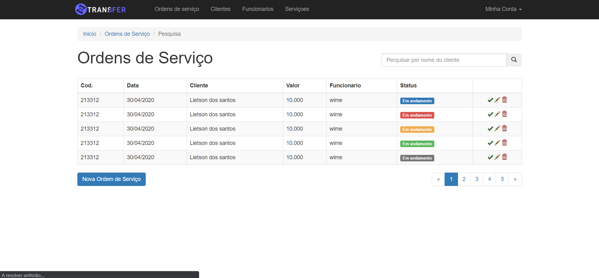

# Ordem-de-Serviço
Uma Site Fictício de ordem de serviço

### 🛠 Tecnologias

As seguintes ferramentas foram usadas na construção do projeto:

- HTML5
- CSS3
- Bootstrap

Feito com ❤️ por Lietson dos santos 👋🏽 Entre em contato!

 