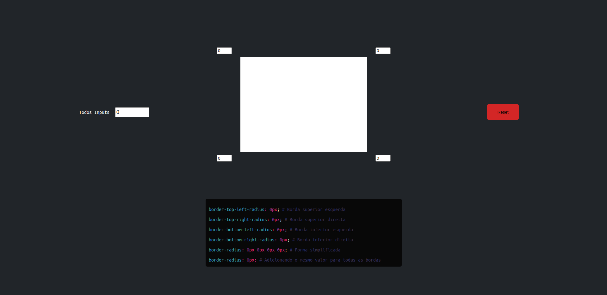

<h1 align="center">SetBorder - Vanilla</h1>

<p align="center">
    
    &nbsp;&nbsp;
    &nbsp;&nbsp;
    
</p>

<p align="center">
    <a href="#Technology">Technology</a>&nbsp;&nbsp;&nbsp;|&nbsp;&nbsp;&nbsp;
    <a href="#Project">Project</a>&nbsp;&nbsp;&nbsp;|&nbsp;&nbsp;&nbsp;
    <a href="#Installation">Installation</a>&nbsp;&nbsp;&nbsp;|&nbsp;&nbsp;&nbsp;
    <a href="#Technology">Technology</a>&nbsp;&nbsp;&nbsp;|&nbsp;&nbsp;&nbsp;
    <a href="#License">License</a>
</p>

<h2 id="Project">💻 About the Project</h2>

Actually, I only did this project because I had nothing to do lol, but the focus is to make it easier to round the edges of a `DIV` or any other HTML element, this project is not yet 100% responsive, that is, it is not yet supported on mobile devices example: Tablets, Phones, etc ...

In the image below we can see the project.


In the image above we can see `4 inputs` in each corner of the` DIV`, you can change the value of each input to be able to round each corner that the input represents from the had and its `CSS` value is dynamically generated.

We also see an input called `All inputs`, unlike the other 4 inputs, this input changes the value of all borders and similar to the other inputs its CSS value is generated dynamically.

We can also see a `Red button` this red button when it is clicked it resets all edges.

<h2 id="Installation">How To Use 🔧</h2>

---
<br />

```bash
# Clone this repository
$ git clone https://github.com/username/setborder

# Go into the repository
$ cd setborder

# Run the index.html file with any browser.
```

<h2 id="Technology">🚀 Technology</h2>

---

- [HTML](https://developer.mozilla.org/pt-BR/docs/Web/html)
- [CSS](https://developer.mozilla.org/pt-BR/docs/Web/css)
- [JAVASCRIPT](https://developer.mozilla.org/pt-BR/docs/Web/JavaScript)

<h2 id="License">License 📄</h2>

This project is licensed under the MIT License - see the [LICENSE.md](LICENSE.md) file for details

[](https://twitter.com/https://twitter.com/username) [](mailto:johndoe@gmail.com)
