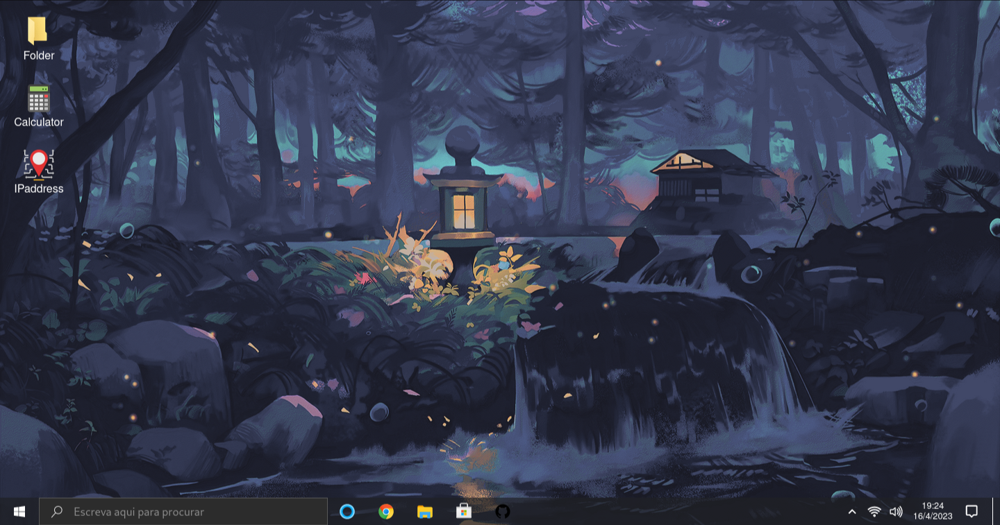

<h1 align="center">Welcome to my web portfolio :wave:</h1>

    
    &nbsp;&nbsp;
    &nbsp;&nbsp;
    

    <a href="#about">About</a>&nbsp;&nbsp;&nbsp;|&nbsp;&nbsp;&nbsp;
    <a href="#technology">Technology</a>&nbsp;&nbsp;&nbsp;|&nbsp;&nbsp;&nbsp;
    <a href="#license">License</a>

 

## :speech_balloon: About
This is my personal portfolio based on the Windows 10 interface, I would like to share the experience of using my computer to have access to all my projects and all my professional information in an innovative and intuitive way using an interface that millions or billions of users use it every day, which in this case is the default interface of windows 10, out of curiosity I don't use windows 10 in my day-to-day :smile:.

 

> This project is already hosted on the Netlify website and ready to use, to access the web page click [aqui](https://windows10project.netlify.app/).

 

## :sparkles: Preview

Home page  

  

 

## :cursing_face: Difficulties

The biggest difficulty during development was cloning all windows 10 animations and cloning some apps like file explorer.

## :rocket: Technologies

This project was developed with the following technologies:

- [Vite](https://vitejs.dev/)
- [React.js](https://react.dev/)
- [TypeScript](https://www.typescriptlang.org/)
- [Styled-components](https://styled-components.com/)
- [Prettier](https://prettier.io/)
- [EsLint](https://eslint.org/)
- [React-icons](https://react-icons.github.io/react-icons/)

## :memo: License

This project is licensed under the MIT License - see the [LICENSE.md](LICENSE.md) file for details

---

Copyright © 2022-2023 [Lietson Dos Santos](https://github.com/username).
